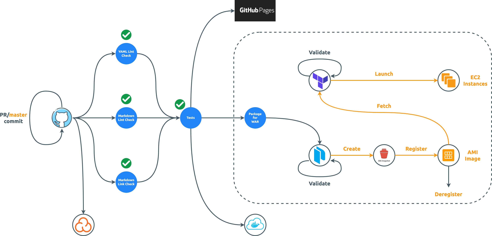

Kneipe
======

[![Apache License][Apache License Badge]][Apache License, Version 2.0]

Phases
------

1. Phase 1 - [A Collection of Bash Shell Script](https://github.com/paion-data/hashistack/tree/4f08be0926ca8bda6da3078c37b832915b966988)
2. Phase 2 - [CHEF](https://github.com/generation-software/Kneipe/tree/bf2fe169ccef087e56e58ba27ac308ca88d5317a): When I
   was working at Yahoo! from Feb 22nd, 2016 to Oct 22nd, 2019, I saw the extensive usage of th CHEF in the internal
   CI/CD's of Yahoo's software development. This notion of _Infrastructure as Code_ sparked my interests on DevOps.
3. [HashiCorp](): I was researching deploying k8s and Google came up a concept I was never heard of:
   [k8s through AMI](https://github.com/awslabs/amazon-eks-ami). It was this GitHub repo that open up a whole new world
   to my career: HashiCorp, AWS AMI, and
   [Immutable Infrastructure](https://www.hashicorp.com/resources/what-is-mutable-vs-immutable-infrastructure). The
   notion of immutable infrastructure as advanced by HashiCorp grabbed my deep interests so intensively that kept
   myself learning and that incubated this phase. It condensed my passion for the best practice of software
   infrastructure.
4. HashiCorp + Screwdriver
5. back to phase 1

   

License
-------

The use and distribution terms for [HashiStack]() are covered by the [Apache License, Version 2.0].

[Apache License, Version 2.0]: https://www.apache.org/licenses/LICENSE-2.0
[Apache License Badge]: https://img.shields.io/badge/Apache%202.0-F25910.svg?style=for-the-badge&logo=Apache&logoColor=white

[GitHub Workflow Status Badge]: https://img.shields.io/github/actions/workflow/status/paion-data/hashistack/hashistack-ci-cd.yaml?branch=master&logo=github&style=for-the-badge
[GitHub Workflow Status URL]: https://github.com/paion-data/hashistack/actions/workflows/hashistack-ci-cd.yaml
