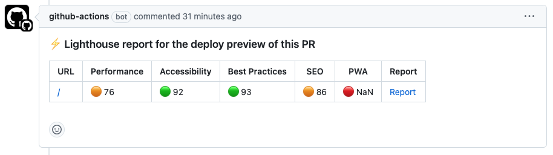

To use this action, make sure a `.env.test` file is in the project root. In case not needed, simply make the `.env.test`
an empty file. Import it in the following way:

```yaml
name: CI/CD

"on":
  pull_request:
  push:
    branches:
      - master

  lighthouse:
    if: github.ref != 'refs/heads/master'
    uses: paion-data/hashistack/.github/workflows/lighthouse.yaml@master
    with:
      node-version: 22
```

In the example above, the node 22 and the most recent stable yarn version is assumed in the CI/CD project.

Configurations
--------------

- __node-version__: Node.js version used to run the lighthoused React App. Default to __22__. The version can be
  customized using the `node-version` parameter. For example, the configuration below sets the node version to 20:

  ```console
  lighthouse:
    if: github.ref != 'refs/heads/master'
    uses: paion-data/hashistack/.github/workflows/lighthouse.yaml@master
    with:
      node-version: 20
  ```

- __env-path__: The path to the `.env` file of the lighthoused React App if provided. For example, `.env.test`. If no
  .env is needed, simply ignore this option; otherwise `env-path`:

  ```console
  lighthouse:
    if: github.ref != 'refs/heads/master'
    uses: paion-data/hashistack/.github/workflows/lighthouse.yaml@master
    with:
      env-path: .env.test
  ```

- __budget-path__: The path, relative to project root, of the
  [`budget.json`](https://github.com/treosh/lighthouse-ci-action?tab=readme-ov-file#budgetpath) file which describe the
  performance budget. Default to `./.github/lighthouse/lighthouse-budget.json`. The file location can be customized
  using the `budget-path` parameter. For example, the configuration below assumes the `budget.json` to be located in the
  project root:

  ```console
  lighthouse:
    if: github.ref != 'refs/heads/master'
    uses: paion-data/hashistack/.github/workflows/lighthouse.yaml@master
    with:
      budget-path: ./lighthouse-budget.json
  ```

- __config-path__: The path, relative to project root, of the
  [`lighthouserc.json`](https://github.com/GoogleChrome/lighthouse-ci/blob/main/docs/configuration.md) filefor full
  control of the Lighthouse environment and assertions. Default to `./.github/lighthouse/lighthouserc.json`. The file
  location can be customized using `config-path` parameter. For example, the configuration below assumes the
  `lighthouserc.json` to be located in the project root:

  ```console
  lighthouse:
    if: github.ref != 'refs/heads/master'
    uses: paion-data/hashistack/.github/workflows/lighthouse.yaml@master
    with:
      config-path: ./lighthouserc.json
  ```
